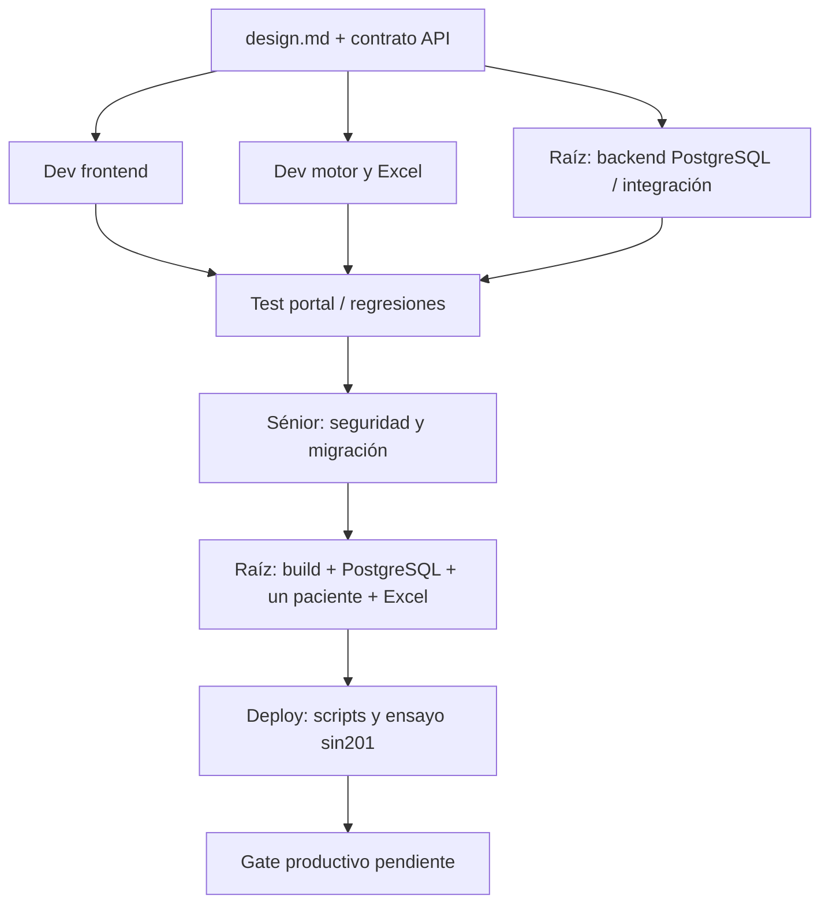

# Entrega V1 local — 8 de septiembre de 2026

## Estado y ubicación

Proyecto: `/home/mdconsgroup/projects/compareforms` en WSL Ubuntu. Un solo proyecto; código nuevo en `backend/` y `frontend/`, cargas privadas nuevas en `documents/`. Se conservaron los meses anteriores, PDF y aplicación legacy sin moverlos ni eliminarlos. Copia de trabajo y Excel de entrega en `C:\102025_IESS_Dr. Carlos Robles Medranda\compareforms_project`.

**Implementación local para ensayo, no aceptación de exactitud clínica ni despliegue productivo.** PostgreSQL17.11 local aislado en54327; venv nuevo `backend/.venv`; React compilado localmente. No se instaló Node ni se desplegó a201. Ningún modelo fue entrenado, descargado ni consultado. OCR usa Tesseract spa/eng en CPU; no se atribuye esta ejecución a GPU NVIDIA.

## Funcionalidad entregada

- Acceso por usuario/contraseña, Argon2, sesión HttpOnly, CSRF y separación de organizaciones. Alta por administrador, sin registro público.
- Lotes mensuales con ZIP de origen manual (DALIA u otra fuente) y ZIP modificado. Rechazos visibles, sugerencias por nombre y confirmación explícita de paciente/atención. Nombres con/sin índice y sufijos origen/modificado no exigen renombrar los PDF.
- Cero parejas bloquea el inicio; faltantes/rechazos bloqueantes necesitan aceptación explícita de alcance parcial. Nunca se publica igualdad como resultado de no comparar.
- Trabajos PostgreSQL persistentes, idempotencia, snapshots de documentos, worker separado, heartbeat/lease, fencing y bloqueo asesor entre procesos.
- Opción A: correspondencia de páginas por costo mínimo, texto nativo/OCR, diferencias antes/después, importes con Decimal y contexto, diferencias gráficas pendientes de cotejo. Una página sin pareja automática no es una eliminación/incorporación confirmada.
- Excel con8hojas, paciente al inicio, filtros, colores por tipo, contenido original/modificado y páginas físicas. Para una línea retirada dentro de una página equivalente se conservan ambas páginas; una página completa no localizada requiere revisar la correspondencia.
- Portal con visor, descarga por ejecución, decisiones append-only, omisiones manuales e historial. Propuestas de mejora registradas con procedencia, sin modificar Roboti.
- Interfaz de estrategia reservada para B encoder-decoder. Más de1000 PDF únicos permite evaluar elegibilidad; exige además anotaciones adjudicadas, separación de entrenamiento/validación por paciente/tiempo y autorización. No activa entrenamiento por sí solo.

## Validación realizada

La suite final anterior a la prueba adicional de desactivación aprobó **70 pruebas backend y 19 frontend**; la regresión de mantenimiento de usuarios se ejecuta también en el cierre. Una advertencia de deprecación de Starlette/AnyIO no produjo fallos. Se cerró el servidor HTTP temporal al concluir; PostgreSQL local y sus datos se conservaron. Inicie API y worker con `ops/start-local.sh`.

- Pruebas backend: autenticación/CSRF, aislamiento, ZIP traversal/symlinks/tamaños, rechazo antes de multipart, chunked, cero parejas, idempotencia, alcance parcial, feedback, recuperación/fencing, comparador, límites raster y Excel. Pruebas frontend: formularios, filtros, feedback, incertidumbre, fechas, API y bloqueo de comparación vacía. Los resultados completos se verifican con `ops/validate-local.sh` en este entorno de desarrollo.
- Alembic `upgrade head` y `check` contra PostgreSQL real: sin operaciones nuevas pendientes. Migración inicial congelada:13tablas y13índices, sin importar modelos vivos; paridad adicional probada con SQLite temporal.
- TypeScript y build Vite aprobados. Lockfile de dependencias conservado. `node_modules` solo en WSL local.
- Navegador: login real, pantalla principal, checkbox manual, creación de lote y botón bloqueado con0parejas verificados visualmente. La carga mediante selector del navegador se interrumpió y venció la sesión: **no se considera aprobada esta prueba UI completa**. La carga ZIP, asociación, worker y descarga sí se probaron mediante el contrato HTTP real con PostgreSQL.
- Excel: reabierto con openpyxl, inspección con artifact-tool local, sin errores de celdas detectados y revisión visual de sus8hojas. Esto prueba estructura/presentación, no sensibilidad clínica.
- Deploy frontend: sintaxis, dry-run/rollback y rechazo de destinos inseguros probados. SSH, Nginx y activación/rollback reales en201 no ejecutados.

## Un paciente real, no112

Se usó únicamente **ALARCON CARPIO DIGNA ASUNCION**, período2026_06. PDF original27páginas; modificado48páginas: diferencia física neta **+21**, que **no equivale a21páginas añadidas confirmadas**.

Excel de entrega: `documents/validation-v1/comparativo_alarcon_v1_validado.xlsx`. Ejecución `8575627a-46a7-4a29-9c88-05a2b9aa63b2`, motor `deterministic-a/1.0.1`: **parcial/no concluyente**, con6observaciones de texto modificado y66avisos de revisión. No son72errores confirmados ni se conoce su gravedad por ese conteo. Los19/40candidatos internos sin asociación no deben comunicarse como páginas retiradas/añadidas reales.

Diagnóstico visual de control: hay formularios escaneados equivalentes que no se asocian de manera automática por cambios de margen, escala o rotación, incluida una tabla girada. El hash raster exacto no resuelve estas transformaciones. Es necesario incorporar asociación visual perceptual y adjudicación de páginas antes de afirmar cobertura completa. Los umbrales actuales son heurísticos, no calibrados con un gold set de auditoría. El mínimo costo matemático de asociación no demuestra mínimo error empírico.

No se confirmaron cambios monetarios en este expediente con evidencia suficiente para la hoja Importes. Eso no prueba igualdad de los importes de todas las páginas. El caso de pinza120,18→118,75 está cubierto por regresión sintética, no se atribuye a este paciente sin evidencia.

## Límites y siguiente aceptación

1. Terminar smoke UI: ambos ZIP, asociación, botón, progreso, visor y descarga con cuenta institucional. Las cuentas QA se desactivan conservando historial; el administrador institucional se crea siguiendo `backend/README.md`.
2. Mejorar correspondencia visual con rotaciones/escala y probar con páginas adjudicadas; ni imágenes ni firmas se autentican automáticamente. Una revisión manual prevalece como anotación, no altera a escondidas el resultado del motor.
3. Rúbrica1–100 pendiente de aprobación/calibración: no se inventan porcentajes de gravedad. El porcentaje textual usa su propio denominador y no es error clínico.
4. El Excel descargado es snapshot del motor: feedback posterior queda en PostgreSQL, pero aún no se exporta automáticamente en una nueva versión de ese Excel. Editar la hoja de revisión no sincroniza la base.
5. Roboti automático requiere contrato M2M propio y autorización; permanece deshabilitado. Las propuestas no modifican reglas/base/código del generador.
6. Antes de201: HTTPS/DNS, usuarios institucionales, cuenta runtime sinDDL, secretos, respaldos/restauración, límites de disco/concurrencia, parsers aislados con límites de tiempo/memoria, retención, pruebas de proxy/worker y aceptación sénior productiva. El despliegue del backend sigue siendo un corte separado; `deploy_front.sh` solo publica estáticos.

## Grafo ejecutado de trabajo

Ver `backend/README.md` para iniciar el portal y `ops/README-deploy.md` para publicación estática. El script `run_compare.py` y `deploy.sh` raíz son legacy conservado; no son la interfaz ni el despliegue V1.
