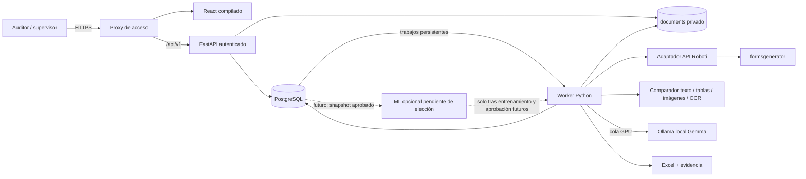
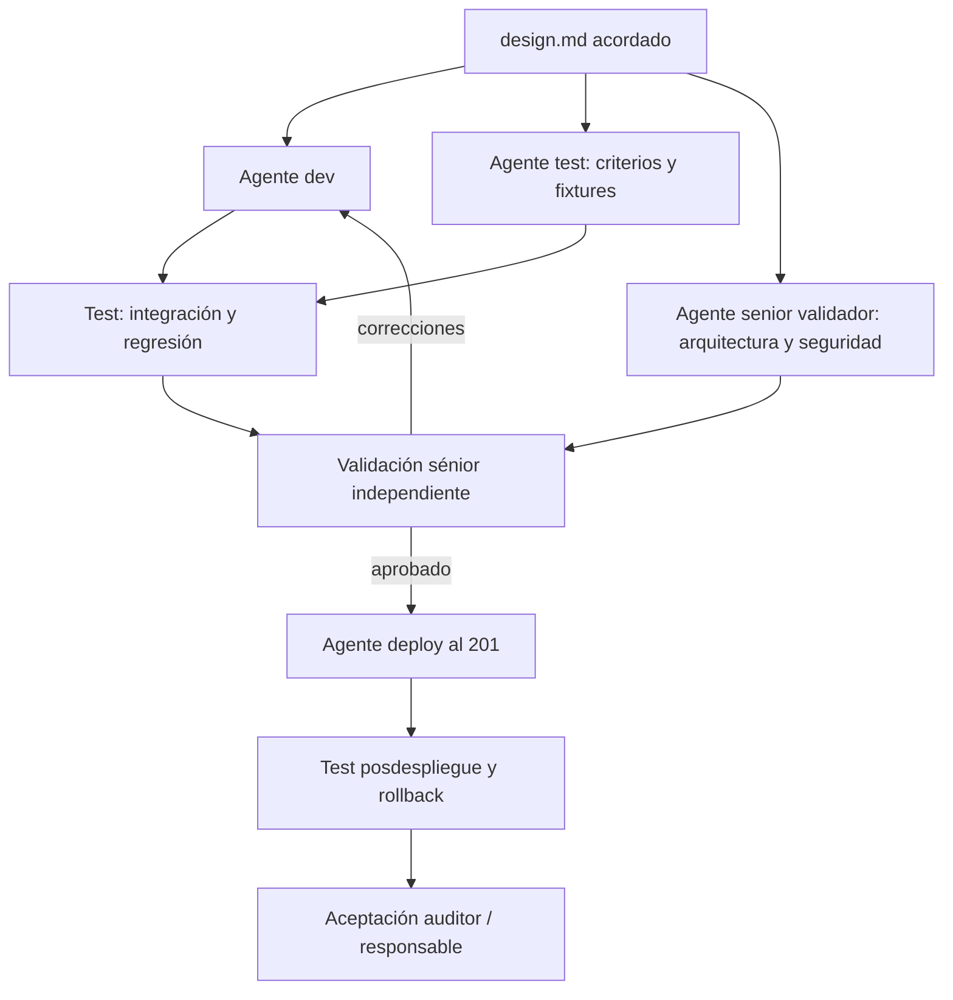

# CompareForms — arquitectura del portal de auditoría documental

Versión: 0.4, implementación V1 autorizada · Fecha: 2026-09-08. PostgreSQL y opción A de mínimo error elegidos. Se reserva una extensión futura denominada **B encoder-decoder** por el usuario, evaluable al superar 1000 PDF únicos. No generar ni entrenar modelos ahora.

**Identidad compartida autorizada:** CompareForms usa el mismo correo/contraseña y fuente de usuarios que Roboti / Aitrol. Un adaptador MySQL de solo lectura comprueba cuenta activa, roles 1/11/22 y empresa autorizada. PostgreSQL mantiene membresías por empresa y sesiones propias; no replica contraseñas ni hashes externos. Esto sustituye el alta de contraseñas locales planteada inicialmente. No habilita la generación M2M ni comparte tokens privados, cookies o contraseñas con el frontend de Roboti. Implementación, configuración y evidencia: `backend/AUTENTICACION_AITROL.md`.

Actualización de decisiones: la denominación futura B encoder-decoder sustituye la letra C de la comparación de alternativas de §12; aquellas alternativas se conservan como contexto, no como decisiones pendientes. Superar 1000 archivos PDF únicos (checksum, sin contar duplicados) no equivale a 1000 pacientes/pares ni garantiza corpus apto: exige etiquetas adjudicadas, cobertura de clases, pruebas independientes y autorización antes de entrenar. V1 entrega portal manual y motor A; Roboti automático continúa bloqueado por su contrato M2M. El contrato técnico vigente para esta entrega está en `implementation-contract.md`.

## 1. Alcance y decisiones

Este documento contiene arquitectura total y fases; no todos sus componentes están implementados. La V1 local autorizada implementa carga manual, usuarios/sesiones, PostgreSQL, cola/worker, motor determinista A, Excel y revisión/propuestas. `backend/README.md` documenta operación y `VALIDACION_V1.md` separa pruebas realizadas de pendientes. No autoriza por sí solo cambios en Roboti, sus bases ni un despliegue productivo. El modelo futuro B encoder-decoder sigue sin generar ni entrenar. Las tres alternativas históricas de §12 se conservan como contexto de la decisión ya tomada.

Objetivo: permitir a auditoría cargar expedientes, obtener o cargar su versión de origen, comparar con evidencia verificable, descargar Excel y convertir observaciones confirmadas en mejoras controladas de Roboti.

Decisiones vigentes:

- Un proyecto y repositorio: `backend/`, `frontend/`, `documents/`.
- React + TypeScript + Vite + Bootstrap local para el portal. **Confirmado por el usuario: Node y `node_modules` solo en su WSL de desarrollo/compilación; en 201, únicamente `dist` para el frontend.** Dependencias fijadas y lockfile versionado; no `latest`, CDN ni scripts remotos en producción.
- FastAPI conserva el motor Python, con API separada de un proceso trabajador persistente. El botón crea un trabajo; no ejecuta una línea de shell enviada desde el navegador.
- PostgreSQL para membresías de identidad externa, sesiones, lotes, asociaciones, ejecuciones, evidencia, revisiones, propuestas y modelos. Aitrol es la autoridad de contraseñas/estado/empresa; el portal aplica su mapeo de permisos. PDF/ZIP/XLSX en almacenamiento privado, no dentro de tablas ni directorios públicos.
- Roboti integrado por API mediante un adaptador; CompareForms no escribe directamente en MySQL/Aitrol ni altera `formsgenerator/config` desde una observación.
- Estrategia elegida: opción A determinista y extensión futura B encoder-decoder, tras más de1000 PDF únicos, corpus adjudicado y evaluación autorizada. La asignación de páginas minimiza su costo definido; no acredita que ya se haya minimizado el error empírico sobre un gold set. No se ha descargado, generado ni entrenado modelo. Jamás aplicar cambios clínicos o reglas automáticamente.
- El PDF modificado es un documento de referencia aportado por auditoría, no una verdad clínica infalible.

## 2. Situación existente comprobada

Lectura local en WSL de `/home/mdconsgroup/projects/compareforms` y `/home/mdconsgroup/projects/roboti/formsgenerator`, sin consultar secretos ni hacer llamadas de generación.

| Componente | Evidencia actual | Consecuencia para el diseño |
|---|---|---|
| CompareForms | `app/main.py` expone `/months/{month}/run`; llama a `run_month` de forma síncrona | Extraer orquestación a worker; HTTP devuelve 202 |
| Comparador | `discover` exige `número - nombre.pdf` y empareja por índice | Reemplazar por asociación de expediente/atención confirmada; índice solo indicio |
| Ejecución | Con cero pares puede escribir reporte y devolver `completed` | Bloquear el inicio vacío; estado no evaluado y score nulo |
| Configuración | `COMPAREFORMS_DATA_ROOT` permite elegir raíz | Migración a `documents/` sin reescribir archivos de origen |
| Concurrencia | Locks en memoria del proceso | No protegen entre workers/procesos; usar locks/leases persistentes |
| Roboti | FastAPI; trabajos, artefactos, perfiles, planillas y control de lotes | Reutilizar contrato, sin replicar el generador |
| Roboti generación | API M2M existente bajo `/api/v1/integrations/aitrol/` requiere planilla, actor e idempotencia | No suplantar a Aitrol ni asumir que la autenticación sirve ya a CompareForms |
| Roboti fuente | Consulta MySQL/Aitrol de solo lectura; estado propio en SQLite | CompareForms tendrá su PostgreSQL independiente |
| Roboti salida | PDF consolidado, XLSX y `documentos_faltantes.csv`; ZIP opcional | Importar únicamente el PDF consolidado como origen; faltantes como metadatos de completitud |

La disponibilidad, rutas y puertos productivos del 201 no se verificaron en esta fase. No asumir que la copia local es idéntica a producción. El README de Roboti describe backend 8013 y frontend 8014: no reutilizar esos puertos sin inventario.

## 3. Arquitectura de ejecución



Despliegue recomendado en 201: un proxy HTTPS, FastAPI, worker y PostgreSQL; Ollama ya existente. El proxy sirve React estático y reenvía `/api/v1`; también es viable servir `dist` desde FastAPI detrás del mismo proxy. En ambos casos los PDF se descargan exclusivamente mediante autorización backend. No servidor Node de producción.

Cola inicial: tabla PostgreSQL `jobs`; selección atómica mediante `FOR UPDATE SKIP LOCKED`, lease con expiración, heartbeat y reintentos acotados. API y worker son procesos diferentes. La transacción de selección se cierra antes del OCR o de una llamada externa. La cola no promete ejecución exactamente una vez: el procesamiento es idempotente y recuperable. No usar `BackgroundTasks` como única garantía para trabajos largos [S2]. PostgreSQL admite `SKIP LOCKED` para consumidores de tablas tipo cola [S3].

Concurrencia inicial configurable: 1 tarea GPU y 1–2 tareas OCR CPU, con cuotas de memoria, disco, páginas y tiempo. Tesseract se ejecuta en CPU; NVIDIA se usa para Ollama y para ML compatible con CUDA. Comparar y entrenar no deben competir libremente por la GPU. Un recurso persistente de exclusión controla las tareas iniciadas por CompareForms; usos externos de Ollama requieren coordinación operativa y comprobación de capacidad.

El worker persiste resultados por expediente y etapa, hash de entradas y versiones de extractor/modelo/reglas. Una caída reanuda tareas pendientes; no borra un informe anterior. Un reintento genera artefactos temporales que se publican atómicamente después de validar. Cancelar es cooperativo y conserva resultados parciales claramente identificados.

Cada ejecución usa `batch_id` y `run_id` con un snapshot inmutable de documentos, emparejamientos y parámetros; una nueva carga no modifica un trabajo en marcha. Pasar rutas y parámetros explícitos al motor, nunca cambiar variables de entorno globales por solicitud. La cola y los artefactos usan control de versión/propietario del lease al publicar, para rechazar resultados de un worker cuyo lease ya expiró.

## 4. Estructura del proyecto

```text
compareforms/
├── design.md
├── README.md
├── backend/
│   ├── app/
│   │   ├── main.py
│   │   ├── api/               # auth, batches, uploads, cases, runs, reports, feedback
│   │   ├── core/              # configuración, seguridad, logging
│   │   ├── db/                # modelos, repositorios, migraciones
│   │   ├── services/          # casos de uso independientes de HTTP
│   │   ├── integrations/      # adaptador Roboti y Ollama
│   │   ├── comparison/        # páginas, OCR, texto, tablas, imágenes, puntuación
│   │   ├── reporting/         # Excel y guía de evidencia
│   │   ├── workers/           # cola, heartbeat, ejecución por etapas
│   │   └── ml/                # exportar, entrenar, evaluar, inferir
│   ├── migrations/
│   ├── tests/
│   ├── requirements.txt
│   └── requirements-ml.txt    # entorno ML separado del API
├── frontend/
│   ├── src/                  # React/TypeScript y Bootstrap empaquetado
│   ├── public/
│   ├── package.json
│   ├── package-lock.json
│   └── dist/                 # compilado, no versionado
├── documents/                # privado, fuera de Git y despliegues de código
│   ├── 2025_10/
│   ├── 2026_03/
│   └── 2026_06/
│       └── batches/<uuid>/
│           ├── uploads/      # ZIP originales inmutables
│           ├── pdf_origen/    # objetos con UUID; nombre original en BD
│           ├── pdf_modificado/
│           └── runs/<uuid>/   # evidencias, manifiesto y Excel
├── models/                   # modelos/datasets privados, fuera de Git
├── ops/                      # servicios, proxy, respaldo, restauración
├── deploy.sh                 # backend/worker y migraciones controladas
└── deploy_front.sh           # compila local y envía solo estáticos
```

Un mes puede contener varios lotes, empresas y atenciones del mismo paciente. Las claves son UUID; ni nombre, cédula, mes ni índice son una clave global. La estructura mensual existente se importa como lote legacy, preservando su origen.

`run_compare.py` deja de ser la interfaz del usuario. Durante la transición se conserva como wrapper del servicio interno para no romper ejecuciones; solo se retira cuando portal, worker y recuperación estén validados. El botón llama a la API, y esta al mismo servicio; no hay dos motores de comparación.

## 5. Portal y recorrido del auditor

Menú: **Nueva comparación · Historial · Mejoras de Roboti · Usuarios y permisos**. Un apartado de **Modelos** queda restringido a supervisión/técnicos.

### 5.1 Nueva comparación

```text
Período [Junio 2026]  Empresa/prestador [...]  Seguro [IESS/MSP]
Nombre de revisión [...]                     [Guardar borrador]

1. Documentos ajustados por auditoría
   [ Arrastrar ZIP de pdf_modificado / Seleccionar archivo ]

2. Origen
   [ ] Usar carga manual del origen en lugar de Roboti
       Desmarcado: seleccionar planillas/atenciones y generar con Roboti
       Marcado: [ZIP de pdf_origen] Fuente [DALIA / Otro] Versión/fecha [...]

3. Validación y asociación
   Paciente | Atención | Modificado | Origen | Fuente | Estado | Resolver
   15 archivos recibidos / 12 pares listos / 2 faltantes / 1 ambiguo

   [Validar archivos] [Generar originales] [Comparar expedientes listos]
```

El checkbox es explícito; cambiarlo no borra cargas previas silenciosamente ni mezcla procedencias. Si se quieren fuentes mixtas, crear lotes separados en V1. El modo Roboti bloquea la generación si no existe configuración/autorización de integración o no se identificó la planilla. Mostrar explicación y permitir que el usuario elija manualmente la alternativa; nunca fallback oculto.

Con 0 pares confirmados: botón deshabilitado y API 422 `NO_COMPARABLE_PAIRS`. Faltantes/ambiguos siempre visibles. Para comparar solo los pares listos, el auditor acepta un alcance parcial que queda en Excel y BD. Progreso separado: recepción, extracción, asociación, generación, comparación, revisión y reporte. Cerrar el navegador no cancela nada.

### 5.2 Detalle de expediente

Dos visores PDF autenticados con salto a página física y región marcada; columna de hallazgos filtrable por tipo y estado. Cada observación incluye documento/sección, valor de origen, valor modificado, acción (añadido/retirado/cambiado/reubicado), páginas en ambos PDF, confianza de extracción y revisión humana.

Ejemplo de redacción, no hallazgo universal: «Insumo: pinza de biopsia. Importe en origen: USD 120,18; importe en documento modificado: USD 118,75; variación: USD −1,43. Revisar base de cálculo y repercusión en liquidación». El sistema debe extraer la línea completa, cantidad, tarifa e impuestos; no deducir la corrección del arancel a partir del importe final.

Acciones: **Confirmar observación · Corregir clasificación · Falso positivo · Añadir diferencia no detectada · Solicitar revisión · Proponer mejora**. Comentario libre y etiqueta estructurada; historial de ediciones, no sobrescritura silenciosa. Hallazgo manual exige evidencia y registra autor/procedencia; no se atribuye al detector automático. Es esencial para registrar omisiones y construir la evaluación de mínimo error.

### 5.3 Historial y Excel

Historial por período, empresa, usuario, fuente y estado. Descargar el Excel de una ejecución concreta; ninguna descarga apunta ambiguamente al último archivo de otra ejecución.

Hojas: Resumen ejecutivo, Expedientes, Hallazgos, Guía de páginas, Importes, Revisión del auditor, Metodología y Trazabilidad. Encabezados legibles, filtros, paneles fijos, texto ajustado, fechas y monedas formateadas. Azul informativo, ámbar pendiente, rojo hallazgo prioritario, verde sin diferencias detectadas solo con ejecución completa. Color siempre acompañado de texto.

Los enlaces de evidencia remiten al portal autenticado con IDs opacos; no a rutas del servidor. Neutralizar fórmulas inyectadas en celdas y sanitizar textos. Un informe parcial lleva «PARCIAL / NO CONCLUYENTE» y detalla cuántos expedientes y páginas faltan. Sin pares no se genera un informe de comparación normal; puede exportarse un diagnóstico de carga claramente diferente.

## 6. Integración segura con Roboti

El nombre `ADUM VERA YAMIL EDUARDO.pdf` identifica un archivo, pero no determina inequívocamente una planilla/atención. Para generar se necesita resolver empresa, seguro, período y `archivo_plano_cabecera_id`; verificar identificación y atención en el contrato de Roboti. Un nombre o prefijo numérico no autoriza elegir automáticamente un expediente con homónimos.

Adaptador propuesto `RobotiClient`: `list_planillas`, `resolve_case`, `create_generation`, `get_generation`, `list_artifacts`, `download_consolidated_pdf`. Son interfaces internas propuestas, no endpoints afirmados como existentes.

API observada: `POST /api/v1/integrations/aitrol/generation-jobs` y consultas de jobs/artefactos documentadas en Roboti. La creación exige `archivo_plano_cabecera_id`, `actor_user_id`, **`expected_num_paciente`**, opciones de artefactos y `Idempotency-Key`; el contrato incluye validación del actor y empresa. Obtener el número esperado de planilla por consulta autorizada, no inferirlo del prefijo del PDF.

**Bloqueo de integración confirmado en código local:** la autenticación M2M existente cubre el prefijo `/integrations/aitrol/`; las consultas de planillas, jobs, artefactos y descarga quedan fuera de él y requieren sesión humana, además del control de proxy en producción. Crear un token nuevo no completa el circuito. Es necesario acordar/extender una identidad M2M **CompareForms** que abarque descubrimiento autorizado, creación, consulta y descarga, con ámbito de empresa y actor delegado verificable. No compartir el token privado de Aitrol, cookies ni contraseña del auditor. La extensión de Roboti será una entrega separada, revisada y autorizada; D1/D2 manuales no dependen de ella.

Secuencia: auditor confirma planillas → worker envía solicitud idempotente → almacena job externo → consulta estado con backoff → importa artefacto PDF permitido → verifica integridad y pertenencia → registra faltantes → crea snapshot de origen. HTTP timeout tras crear un job no provoca una nueva generación sin antes resolver la idempotencia.

No recorrer genéricamente `roboti/output` ni seleccionar «el PDF más reciente». Usar IDs de artefacto asociados al job y comprobar que descargan del host permitido; no seguir URLs arbitrarias. La ruta `output/1` puede reutilizarse, por eso se copia una versión inmutable con SHA-256 y manifiesto.

Guardar: versión/commit de generador si disponible, hash/versión de reglas, fecha de generación, fuente de datos/instante o referencia de snapshot, planilla, job y completitud. Si Roboti no expone estos datos, marcar `desconocido`; no inventarlos. Regenerar hoy un expediente antiguo puede reflejar cambios en los datos fuente: esa diferencia no demuestra un defecto del código.

El schema actual `ArtifactOut` expone ID, job, nombre, MIME, tamaño y URL; no garantiza `artifact_kind=consolidated_pdf`, hash ni versión del generador. Añadir esos campos y la identidad de caso al contrato futuro. Mientras no existan, el adaptador debe resolver el consolidado por una regla explícita validada, marcar procedencia desconocida cuando corresponda y no escoger por tamaño. Propagar estados `partial` y faltantes; un origen incompleto no demuestra que un documento se perdió por una regla errónea.

## 7. Comparación confiable y trazabilidad

Pipeline obligatorio:

1. Validar archivos y límites; inventariar absolutamente todos los aceptados y rechazados con motivo.
2. Asociar expediente y atención: identidad estructurada más contexto; nombre normalizado como sugerencia; índice como pista. Conflictos bloquean. Auditor confirma asociaciones dudosas.
3. Extraer texto, geometría y metadatos; OCR por página/región con texto ausente, inconsistente o insuficiente. Detectar capas OCR defectuosas y no asumir que contar caracteres garantiza lectura correcta.
4. Emparejar páginas/documentos por contenido, tipo, fecha y rasgos visuales, permitiendo reordenación y duplicados. Matching uno-a-uno con candidatos no emparejados; resolver segmentaciones de una página en varias o viceversa como cambio de maquetación con revisión, no como incorporación clínica automática.
5. Comparar texto, campos identificativos, procedimientos, fechas, códigos, tablas e importes con contexto. Importes en Decimal, conservando precisión original y reglas de redondeo; no números flotantes ni reglas tributarias inventadas.
6. Comparar regiones gráficas alineadas para sellos, firmas, imágenes y anotaciones. Una diferencia visual sugiere revisión; OCR textual no prueba firma manuscrita presente/ausente ni autenticidad. No afirmar ausencia de firma solo porque no aparece la palabra «firma».
7. Consolidar hallazgos con IDs de evidencia, limitaciones y niveles de certeza. Ollama puede ayudar a redactar/etiquetar, nunca inventar páginas, cantidades ni causas. Validación de esquema y de referencias contra evidencia existente; fallo de Ollama no anula un resultado determinista completo.
8. Revisión humana; Excel versionado y descarga autorizada.

Identidad binaria diferente no equivale a contenido médico diferente: compresión, OCR y metadatos también alteran el archivo. Hash idéntico permite una salida exacta; hash distinto exige análisis. Ausencia de hallazgos con OCR fallido o páginas no evaluadas es **no concluyente**, nunca «sin diferencias».

Invariante de páginas: `páginas_modificadas - páginas_origen = incorporadas - retiradas`; reubicadas no suman incorporaciones. Caso de regresión conocido: 30 → 50 páginas se reconcilió como 22 incorporadas y 2 retiradas, no simplemente 20 incorporadas. En segmentaciones complejas conservar conteo físico separado de número de documentos.

La igualdad de conteos no prueba que el emparejamiento sea correcto. Antes de convertir ese ejemplo en gold set, adjudicar y guardar el mapa página-a-página, duplicados y evidencia de anexos/retiradas. Un test sintético de reordenamiento completo debe conservar cero añadidas/retiradas y no reutilizar una página para dos parejas.

Separar métricas:

- Variación textual: fórmula versionada sobre tokens de páginas alineadas; explicar denominador y excluir comparaciones ilegibles (mostrar cobertura). No presentarla como porcentaje clínico de error.
- Páginas: incorporadas, retiradas, reubicadas y cambio físico neto.
- Variación económica: valor antes/después, delta y porcentaje relativo cuando el origen no es cero; en cero, porcentaje no aplicable. Separar cambio de tarifa, cantidad, impuesto y total.
- Prioridad de revisión: escala documental 1–100 para hallazgos, rúbrica configurable aprobada por auditoría; no es porcentaje de cambio, probabilidad ni dictamen clínico. `null` para no evaluado; 0 solo para comparación completa sin hallazgos. Confianza independiente de prioridad.

La rúbrica inicial ponderará identidad/atención, integridad documental, importes y soporte gráfico, pero pesos y umbrales no se declararán validados hasta calibración humana. Mostrar el porqué del score y versión de rúbrica. No sumar importes de facturas de soporte como si fueran cargos del paciente.

## 8. PostgreSQL frente a MongoDB

Decisión confirmada por el usuario: **PostgreSQL**. El problema principal es relacional: quién comparó qué versión, qué hallazgo aprobó otro usuario, qué regla se probó, con qué modelo y qué ejecución. Restricciones, transacciones y consultas agregadas ayudan a conservar ese vínculo. Campos variables de OCR/modelo pueden ir en `JSONB`, que permite indexación, sin convertir cada expediente en un JSON gigante [S1].

MongoDB también puede implementar relaciones y transacciones, pero no aporta aquí una ventaja clara que compense separar controles de integridad en más código. No desplegar dos bases para este proyecto. Los PDF no se guardan como JSON ni como contenido binario en PostgreSQL. `pgvector` es opcional futuro; el primer modelo no necesita un segundo servicio vectorial.

Entidades mínimas (UUID, timestamps UTC; UI America/Guayaquil):

| Grupo | Tablas / responsabilidad |
|---|---|
| Acceso | `users`, `roles`, `user_roles`, `organizations`, `user_organizations`, `sessions` |
| Ingesta | `batches`, `uploads`, `documents`, `document_versions`, `upload_rejections` |
| Asociación | `cases` (paciente seudónimo + atención), `case_documents`, `pairing_decisions` |
| Ejecución | `runs`, `jobs`, `job_attempts`, `run_cases`, `generation_requests`, `resource_leases` |
| Evidencia | `pages`, `page_matches`, `findings`, `evidence_regions`, `reports` |
| Validación | `finding_reviews` append-only, `review_adjudications`, `audit_events` |
| Mejoras | `improvement_proposals`, `rule_versions`, `rule_evaluations`, `change_approvals`, `deployment_records` |
| Aprendizaje | `dataset_versions`, `dataset_members`, `training_runs`, `model_versions`, `model_evaluations`, `model_deployments` |

Claves y restricciones: FK con organización coherente; identidad de documento independiente del filename; unicidad de idempotencia dentro de organización/operación y hash del payload; un job activo por objetivo/versionado; original/modificado pertenecen al mismo caso confirmado; revisiones con control optimista de versión. `documents` lleva procedencia `roboti/dalia/manual_otro/auditoria`, checksum, tamaño, tipo validado y storage key. Hallazgos conservan versión de algoritmo y evidencia antes/después; anotación posterior no reescribe el resultado automático original.

Contraseña hasheada, sesiones hasheadas y autorización en backend. SQLAlchemy + Alembic propuestos; versión exacta se fija en implementación después de pruebas. Cuenta runtime sin permisos DDL; cuenta de migración separada. La interfaz jamás admite SQL arbitrario.

## 9. Seguridad y custodia

- Alta y cambios de contraseña en Aitrol; sin registro público ni contraseñas propias en el portal compartido. Verificación bcrypt compatible con Roboti, límites de intentos y sesiones propias. Estado, rol y acceso a empresa se revalidan en cada solicitud autenticada. El modo Argon2id local se conserva solo para pruebas/compatibilidad explícita; no sirve de alternativa ante caída de Aitrol. Recuperación/MFA y revocación por cambio de contraseña deben acordarse con la autoridad de identidad.
- Roles: auditor (cargar/comparar/revisar ámbito asignado), supervisor (adjudicar/aprobar propuestas), técnico (preparar cambio y pruebas), administrador (usuarios/configuración), despliegue (identidad técnica restringida). Separar autor y aprobador de cambios que lleguen a Roboti.
- Cookies de sesión `HttpOnly`, `Secure`, `SameSite`, CSRF en mutaciones; frontend/backend mismo origen. No tokens en localStorage, URLs o logs. HTTPS interno con certificado confiable, CORS cerrado y checks de organización/caso también en descargas y progreso.
- ZIP no confiable: bloquear rutas absolutas, `..`, symlinks, nombres normalizados duplicados, archivos anidados/recursivos y cifrados en V1. Límites configurables por archivo, cantidad, tamaño descomprimido y ratio de expansión; extraer por streaming dentro de cuarentena resuelta. Validar firma real PDF, antivirus si disponible, cuotas y ejecución de parsers en worker restringido sin red [S6].
- Aceptar ZIP plano o subcarpetas por paciente de DALIA/Roboti. XLSX/CSV complementarios no son pares PDF; se inventarían como anexos/rechazos informativos. Selección del consolidado por manifiesto/identidad y revisión; múltiples PDF por paciente requieren elegir el correcto, no escoger por tamaño. No cargar scripts del ZIP ni instrucciones incrustadas en PDF a herramientas.
- PDFs y texto son datos no confiables para Ollama/ML; aislamiento de instrucciones, sin herramientas ni credenciales en contexto. Inferencia local únicamente; no usar modelos `:cloud` con expedientes. No mandar muestras clínicas a búsquedas web, telemetría o proveedores externos.
- Documentos y backups cifrados según infraestructura, permisos mínimos, audit log de acceso/descarga. Retención de originales, derivados, evidencias y datasets a acordar con el responsable institucional antes de producción. Eliminación autorizada debe propagarse a derivados/snapshots/modelos afectados; no prometer anonimato por quitar nombres.
- Respaldar PostgreSQL y `documents` con manifiestos correlacionados, restaurar en ensayo y comprobar hashes. Retención/periodicidad/RPO/RTO requieren decisión operativa. Ningún despliegue debe borrar datos de pacientes.

## 10. API propuesta

Prefijo `/api/v1`; contratos OpenAPI y esquema versionado. Nombres siguientes son diseño futuro.

| Método y ruta | Función |
|---|---|
| `POST /auth/login`, `POST /auth/logout`, `GET /auth/me` | Sesiones humanas |
| `POST /users`, `PATCH /users/{id}` | Gestión autorizada |
| `POST /batches`, `GET /batches` | Lotes y alcance |
| `POST /batches/{id}/uploads` | ZIP con rol original/modificado y procedencia |
| `GET /batches/{id}/inventory` | Aceptados, ignorados, faltantes y conflictos |
| `POST /batches/{id}/pairings/confirm` | Asociación y decisión humana |
| `GET /roboti/planillas` | Búsqueda autorizada de casos fuente |
| `POST /batches/{id}/generate-origins` | Crear jobs Roboti, 202 |
| `POST /batches/{id}/runs` | Validar alcance y encolar comparación, 202 |
| `GET /runs/{id}`, `POST /runs/{id}/cancel` | Progreso persistente y cancelación |
| `GET /runs/{id}/cases`, `GET /runs/{run_id}/cases/{case_id}/findings` | Consulta histórica con ámbito/run explícito |
| `GET /documents/{id}/content` | PDF autorizado; rangos para visor |
| `GET /reports/{id}/download` | Excel concreto; autorización y registro |
| `POST /findings/{id}/reviews` | Feedback versionado del auditor |
| `POST /runs/{run_id}/cases/{case_id}/findings` | Añadir hallazgo manual omitido por el detector, con evidencia |
| `POST /improvements`, `POST /improvements/{id}/approve` | Propuestas y aprobación, no ejecución automática |
| `POST /models/training-runs` (futuro, deshabilitado) | Solo si se elige/autoriza ML; no implementar entrenamiento en esta fase |

Creación de trabajos usa `Idempotency-Key`; conflictos de versión/alcance devuelven 409; tamaño excedido 413; entrada inválida/sin pares 422. No aceptar rutas locales ni órdenes de shell en payload. Progreso por polling inicialmente, SSE opcional más adelante.

Estados de lote: borrador → validando → requiere_asociación / listo → procesando → completo / parcial / fallido / cancelado. Estado de comparación por caso independiente: pendiente, en_proceso, sin_diferencias_detectadas, con_diferencias, no_concluyente, error. Un lote con pendientes/fallidos no se declara completo sin diferencias. Conteos siempre explican denominadores.

## 11. Mejoras de Roboti: del hallazgo al cambio probado

```mermaid
flowchart LR
    H[Hallazgo con evidencia] --> V[Revisión del auditor]
    V -->|confirmado| P[Propuesta de mejora]
    P --> T[Análisis técnico de causa]
    T --> S[Simulación en entorno de prueba]
    S --> A[Aprobación supervisor + técnico]
    A --> D[Despliegue controlado de regla/código]
    D --> R[Regenerar casos y comparar]
    R --> C[Medir mejora / revertir]
```



Menú muestra: problema documental, pacientes afectados (con permiso), evidencia/páginas, origen real, causa confirmada o hipótesis, regla actual, cambio propuesto, beneficio esperado, riesgos, casos de prueba, resultados antes/después, aprobadores y versión desplegada. El auditor debe entender qué se propone mejorar antes de aprobar.

Categorías de causa: dato fuente, regla/selección documental, fórmula o redondeo, plantilla/maquetación, anexo externo, edición no justificada o causa no determinada. No todo ajuste requiere cambiar una regla de Roboti.

**DALIA no es Roboti**: observaciones de origen DALIA sirven para catálogo documental y entrenamiento de clasificación por procedencia. No se contabilizan como defectos de Roboti ni como prueba de mejora suya sin reproducir el caso con una versión identificada de Roboti. Separar métricas por generador/versión y atención comparable.

Mutación real en Roboti solo mediante cambio versionado, revisión, tests, backup/rollback y despliegue por identidad técnica. En V1 el portal prepara una propuesta y expediente de cambio; no publica código ni modifica tablas productivas por un botón de aprobación. Implementación posterior del adaptador de reglas requiere inspección de qué reglas son configurables y qué cambios son código, con contrato específico.

Métrica de mejora: hallazgos confirmados por 100 expedientes comparables, tasa de falsos positivos, minutos de revisión y tipos de corrección por versión/fuente. Comparar conjuntos con similar empresa, procedimiento y calidad de entrada. Menos diferencias no demuestra mejor calidad si se omiten páginas o cambió el conjunto de pacientes.

## 12. Tres opciones matemáticas para minimizar errores — sin generar modelo

### 12.1 Qué significa «min-error» aquí

No existe un algoritmo que garantice error cero en PDFs nuevos. Se busca minimizar un **riesgo empírico definido por auditoría**, con validación independiente y capacidad de abstenerse. No minimizar simplemente el número de diferencias: un sistema que no compara nada produciría cero avisos, pero sería inútil.

Separar tres problemas y tres mediciones: detectar diferencias reales; clasificar/redactar las diferencias detectadas; comprobar que una regla nueva mejora realmente la salida de Roboti. Mejor clasificación del encoder no demuestra menos errores en formularios.

Objetivo operacional común propuesto sobre un conjunto fijo de evaluación:

```text
R = [Σ_k (c_FN,k · FN_k + c_FP,k · FP_k) + c_M · M + c_A · A] / N

Elegir configuración que minimice R en validación,
sujeta a sensibilidad mínima en categorías críticas y presupuesto de revisión.
```

`FN_k`: diferencias verdaderas de categoría k que no se detectan; `FP_k`: avisos de categoría k que no corresponden a una diferencia confirmada; `M`: asociaciones incorrectas, excluidas del cómputo por categoría para no contar doble; `A`: unidades remitidas a revisión humana sin decisión automática; `N`: número fijo de **expedientes del conjunto auditado**, incluidos errores y abstenciones. El resultado es costo ponderado por expediente, no porcentaje. El protocolo define antes de evaluar cada evento contable (campo, página, asociación o revisión), evitando contar la misma observación repetida como varios errores; los pesos convierten los eventos a una escala común. En una unidad abstendida se cuenta el coste de revisión, no una decisión automática errónea; medir después el riesgo residual de la revisión humana por separado. Si queda sin revisar, sigue pendiente y nunca cuenta como acierto.

Los costes `c` son pesos de negocio acordados y versionados, no valores inventados por el modelo. Un emparejamiento de pacientes incorrecto se bloquea además por regla dura: nunca se permite a cambio de un menor coste promedio. Si una clase no tiene ejemplos, no se afirma sensibilidad para ella. La restricción y la capacidad de revisión impiden «minimizar» el error absteniéndose siempre.

Para medir omisiones necesitamos una muestra de **expedientes completos revisados independientemente**, incluyendo casos donde el sistema dijo «sin diferencias». El feedback sobre hallazgos que ya muestra el portal no descubre todos los falsos negativos. Construir gold set adjudicado con revisión doble en casos prioritarios, documentos legibles/ilegibles, homónimos, cambios gráficos y reordenamientos. Mantener ejemplos sin cambios y cambios que el detector inicial omitió.

### 12.2 Opción A — reglas verificables y asociación de costo mínimo

**Contexto:** pocos datos etiquetados; principal problema actual son parejas omitidas, orden de páginas, tablas, importes y evidencia. Es una estrategia matemática sin entrenamiento de un modelo.

Después de confirmar paciente/atención, construir costo `C_ij` de asociar página i del origen con página j del modificado a partir de similitud textual, tipo de formulario, fechas y rasgos gráficos. No usar distancia de número de página como criterio dominante: el auditor puede reordenar bloques enteros.

```text
min Σ_ij C_ij · x_ij + λ_retirada Σ_i u_i + λ_añadida Σ_j v_j
sujeto a Σ_j x_ij + u_i = 1; Σ_i x_ij + v_j = 1
x_ij, u_i, v_j ∈ {0,1}
```

`x_ij` es un emparejamiento; `u_i`/`v_j` permiten dejar páginas sin pareja con costo explícito. Resolver una asignación global con nodos ficticios para añadidas/retiradas, no un algoritmo greedy que consume la primera coincidencia [S8]. Prohibir candidatos incompatibles; diferencias pequeñas entre mejores soluciones implican ambigüedad y revisión. El óptimo matemático es del costo definido, no prueba que la asociación clínica sea correcta. División/fusión de páginas requiere agrupación previa o excepción manual; la ecuación uno-a-uno no la resuelve sola.

Luego aplicar comparaciones deterministas: Decimal y contexto de fila para importes, identidad/fechas, texto alineado y regiones gráficas registradas. Ajustar pesos/umbrales con el gold set y el riesgo R; versiones reproducibles. Una firma gráfica se marca para revisión, no se autentica.

Ventajas: explicable, poco cómputo adicional, funciona antes de disponer de corpus de entrenamiento. Límite: reglas y OCR no comprenden todos los cambios semánticos. Entrega futura: motor corregido, calibración, evidencia de regresión y métricas; no pesos neuronales.

### 12.3 Opción B — encoder Transformer + clasificación sensible al costo

**Contexto:** ya hay un motor A confiable y suficientes observaciones verificadas en PostgreSQL; necesitamos agrupar/clasificar variantes de redacción y sugerir antecedentes. Esta es la primera opción de ML recomendada, no una decisión tomada.

Interpretar `transform_text` como Transformer de texto; no presuponer una biblioteca con ese nombre. Candidato de encoder multilingüe: `sentence-transformers/paraphrase-multilingual-MiniLM-L12-v2`; revisión/licencia/dependencias se fijarían antes de usarlo [S4]. Encoder congelado inicialmente, cabeza lineal multi-etiqueta entrenable; fine-tuning posterior solo si mejora evaluación [S5]. No reemplaza la comparación visual de sellos/firmas.

Entrada: evidencia textual antes/después y características documentales, seudonimizadas. Etiquetas propuestas: cambio_de_importe, documento_incorporado, documento_retirado, reordenación, identificación_o_fecha, soporte_gráfico_por_revisar, maquetación, falso_positivo, otro. Una categoría de causa exige adjudicación adicional; no inferir «fallo de Roboti» de una etiqueta de cambio.

Pérdida de entrenamiento propuesta, entropía cruzada binaria ponderada para K etiquetas:

```text
L(θ) = -(1/n) Σ_i Σ_k [w⁺_k y_ik log(p_ik) + w⁻_k (1-y_ik) log(1-p_ik)]
       + λ ||θ||²
```

La cabeza aprende de revisiones adjudicadas. Pesos ayudan con desbalance/costos, pero la pérdida no sustituye el riesgo operacional: calibrar probabilidades/umbrales por clase en validación y escoger decisión por costo, no por el umbral 0,5 sin justificar [S9]. Tras ponderar clases, no asumir que probabilidades crudas están calibradas. Revisión/abstención cuando ninguna decisión cumpla riesgo aceptable o evidencia esté fuera de distribución. No usar baja confianza para ocultar una diferencia determinista.

Ventajas: aprende patrones aprobados, recupera casos parecidos y requiere menos recursos que generar texto completo. Límites: necesita soporte suficiente y etiquetas adjudicadas por clase; tratar el desbalance sin exigir igual número de ejemplos. Solo clasifica lo que recibe, no garantiza encontrar cambios que extracción/candidatos omitieron. Mantener indicadores end-to-end y motor A; el ML sugiere, no invalida hallazgos aritméticos ni modifica reglas.

Entrega futura si se elige: exportador BD, dataset versionado, entrenamiento/evaluación/inferencia, model card, cabeza entrenada si hay datos y modo sombra. Sin datos elegibles: `insufficient_labeled_data`, no modelo «entrenado» ficticio.

### 12.4 Opción C — encoder-decoder supervisado para observaciones estructuradas

**Contexto:** existe un corpus mayor de pares evidencia → observación corregida por auditor, homogéneo y adjudicado; el objetivo adicional es redactar explicaciones documentales útiles. No usarlo como sustituto del motor A ni como editor autónomo de PDF/reglas.

Entrada: evidencia ya extraída con IDs y campos. Salida restringida: categoría, resumen documental, referencia a evidencias y propuesta de revisión; los valores monetarios, páginas e identidades se copian desde campos verificados, no se generan libremente. La arquitectura concreta y tamaño quedarían pendientes de benchmark de GPU y de elección; no descargar un modelo ahora.

Pérdida de entrenamiento base: probabilidad de la secuencia objetivo redactada/aprobada:

```text
L_seq(θ) = -(1/n) Σ_i Σ_t log P_θ(y_it | y_i,<t, evidencia_i)
```

Minimizar `L_seq` no garantiza veracidad. Añadir en inferencia esquema restringido y un **validador duro** que rechace incumplimientos comprobables de esquema, referencias y campos (por ejemplo, páginas/importes no presentes en evidencia). Las afirmaciones de texto libre conservan revisión humana: el validador no garantiza detectar toda falta de sustento. Esas restricciones no se presentan falsamente como una pérdida diferenciable ya implementada. Elegir configuración en validación por riesgo R, tasa de afirmaciones no sustentadas y esfuerzo de corrección humana, no solo similitud de texto/BLEU/ROUGE. Si no supera validación, usar una plantilla determinista y marcar abstención.

Ventajas: puede producir observaciones más cercanas al lenguaje administrativo de la institución. Límites: mayor costo de entrenamiento/inferencia, más datos emparejados y más riesgo de texto convincente pero falso; el control humano y factual es obligatorio. Un encoder-decoder de texto tampoco determina autenticidad de una firma gráfica.

### 12.5 Comparación para decidir

| Criterio | A: reglas + costo mínimo | B: encoder + clasificador | C: encoder-decoder |
|---|---|---|---|
| Problema principal | No perder/mezclar evidencia; comparar correctamente | Clasificar y recuperar patrones aprobados | Redactar observaciones estructuradas |
| Datos de auditoría | Gold set de prueba/calibración | Gold set + etiquetas adjudicadas | Gold set + pares evidencia/redacción aprobada |
| Entrenamiento | No neuronal | Cabeza, encoder opcional después | Modelo generativo supervisado |
| Cómputo relativo | Menor, excepto OCR/render | Intermedio; se debe medir | Mayor; se debe medir |
| Explicación del resultado | Reglas, importes y páginas | Evidencia + etiqueta sugerida/confianza | Evidencia + texto validado |
| Riesgo dominante | Reglas insuficientes/OCR incorrecto | Omisiones del detector y sesgo de etiquetas | Afirmaciones no sustentadas y deriva |
| Uso propuesto | Base obligatoria desde V1 | Primera evolución de ML si se elige | Fase posterior, no comienzo recomendado |

Recomendación: **construir A, acumular validación humana y elegir B como evolución de ML**. Reservar C para cuando la redacción sea un cuello de botella demostrado y exista corpus adecuado. Son tres opciones de estrategia, pero B/C conservan los controles deterministas de A. No existe evidencia actual para prometer que B o C tengan menor error real en estos expedientes.

### 12.6 Datos, evaluación y gobierno comunes

Fuente: PostgreSQL con observaciones adjudicadas y permiso de uso; snapshot seudonimizado, versionado y mínimo. Datos de pacientes siguen siendo sensibles aunque se borren nombres. No entrenar con afirmaciones automáticas no verificadas ni con comentarios maliciosos. Distinguir DALIA de Roboti en procedencia, etiquetas de causa y métricas; no mezclar como verdad equivalente.

Separar train/validación/test por paciente y atención; controlar duplicados/casi duplicados, plantillas dominantes, empresas y procedimientos. Reservar período posterior como test, evitando pacientes vistos cuando corresponda. Selección de hiperparámetros y umbrales solo en validación. Test congelado una vez por decisión de promoción; nuevas iteraciones requieren gobierno del conjunto para no sobreajustarlo indirectamente.

Medir: precisión/sensibilidad de detección, exactitud de asociación, cobertura de extracción y de automatización, FP por expediente, macro-F1 de clasificación, error monetario absoluto en campos comparables, afirmaciones sin soporte (C), tiempo de revisión y riesgo R. Mostrar soporte por clase y origen, intervalos de incertidumbre y fallos, no solo un porcentaje global. Ningún promedio compensa mezclar pacientes o dejar una categoría crítica sin evaluar.

Gate: no inferioridad respecto a baseline en grupos críticos, mejor riesgo/beneficio en muestra representativa y aprobación sénior/auditor. Umbrales, costos, márgenes y tamaño de muestra se acuerdan antes de evaluar según frecuencia/costo de errores; hoy no hay cantidad de etiquetas verificada que permita fijarlos honestamente. Una prueba con un paciente valida el flujo técnico, no el modelo ni su generalización.

En implementación futura, registrar dataset, modelo, licencia/revisión, semillas, métricas y aprobaciones; inferencia de artefactos confiables y rollback. Nuevas observaciones se acumulan; no hay reentrenamiento por cada comentario ni modificación de pesos en cada consulta. CUDA solo cuando se autorice una fase de entrenamiento y haya capacidad; sin competir con Ollama. Esta fase produce únicamente diseño y decisión pendiente.

## 13. Despliegue y migración

Destino propuesto: `/home/sistemas201/projects/compareforms` en `192.168.66.33`; origen WSL `/home/mdconsgroup/projects/compareforms`. No crear otro repositorio ni mover Roboti. No copiar secretos en scripts; SSH por clave/agent, host key verificada y usuario limitado.

Migración por etapas:

1. Inventario y copia de seguridad verificable del código, configuración, meses y resultados; no mover/eliminar fuentes durante diseño.
2. Crear `backend` y adaptar imports, rutas, worker y tests; conservar wrapper CLI temporal. Cambiar `COMPAREFORMS_DATA_ROOT` a ruta absoluta de `documents`.
3. Registrar lotes legacy con pausa de escrituras durante el corte; copiar/verificar por hash antes de proponer retirar duplicados. Mantener rutas históricas/resultados legibles mediante manifiesto de migración (UUID, rutas anterior/nueva, hash y estado). Importación idempotente: repetir un mes no duplica lotes ni sobrescribe resultados. Nunca fusionar resultados de meses/casos por filename.
4. Crear PostgreSQL/migraciones con cuenta separada; configurar identidad Aitrol de solo lectura y validar un acceso real autorizado, sin crear contraseñas locales; ensayo de restauración.
5. Desplegar API/worker en entorno de prueba y frontend compatible. Prueba integral manual de un caso, luego pequeño lote controlado. No ejecutar los 112 expedientes para la aceptación inicial.
6. Cambiar acceso al portal tras aprobación; preservar rollback de código y rutas previas. Migraciones expand/contract; rollback de frontend no revierte una BD incompatible automáticamente.

`deploy_front.sh` (archivo a implementar en DEV-FRONT/DEPLOY): valida destino permitido, ejecuta instalación reproducible y tests/build en WSL, comprueba `dist/index.html`, checksum y compatibilidad de API. Envía **solo `frontend/dist`** a una release temporal del frontend, activa de manera atómica tras verificación y conserva release anterior. Excluye `.env`, `.git`, `node_modules`, documentos, BD y modelos. No `rsync --delete` sobre raíz compartida; no altera backend ni servicios Roboti. Rollback explícito a release anterior. `--dry-run` sin transferir/activar ni mutar producción.

Comando objetivo, **aún no disponible hasta implementar el script**:

```bash
./deploy_front.sh --host 192.168.66.33 --user sistemas201
```

`deploy.sh` se adapta para backend/worker: artefacto versionado, dependencias fijadas, preflight, plan de migración, respaldo, healthcheck, reinicio controlado y recuperación. Datos/credenciales/modelos fuera de release; servicios apuntan a rutas estables. No reconstruir frontend en 201. El agente de despliegue produce y prueba ambos scripts; ejecutar producción solo después del gate sénior y confirmación operativa.

Contratos de operación que deben implementarse y probarse:

- **Frontend:** releases inmutables de `dist`, bloqueo contra despliegues simultáneos y cambio atómico de `current` en el mismo filesystem. Assets con hash en rutas de release/versionadas, conservados durante la ventana de compatibilidad para que pestañas ya abiertas no fallen al solicitar un chunk anterior. HTML revalidable; assets inmutables. Retener release anterior sin hacer accesibles sus URLs no basta.
- **Permisos:** proxy solo lee estáticos; las descargas privadas las autoriza el API. Worker accede a documentos con permisos mínimos. Identidad de publicación frontend no puede alterar documentos médicos, backend ni Roboti. Validar destino canónico y symlinks dentro del árbol exacto de frontend antes de transferir/activar; rechazar raíces amplias.
- **API/worker:** bloquear temporalmente nuevas ejecuciones, detener adquisiciones nuevas, drenar o checkpointar trabajos activos y verificar compatibilidad de migración/payload/worker antes de activar. `release_id`, hashes, versión mínima/máxima de API, revisión de migración y versiones de payload quedan en manifiesto. Reversión no deja jobs nuevos ilegibles para el worker anterior; si no es compatible, exigir plan explícito y no ofrecer rollback automático engañoso.
- **Readiness:** separar proceso vivo de servicio listo. PostgreSQL inaccesible o migración incompatible bloquea activación. Ollama/Roboti se informan por capacidad; su ausencia no inutiliza toda la consulta histórica o la carga manual si esas funciones son independientes.
- **Backup consistente:** para el primer despliegue, pausa breve de escrituras/jobs, snapshot/export de PostgreSQL y captura de archivos correlacionados bajo manifiesto de backup, luego reanudar. Ensayar restauración en ubicación aislada, abrir ambos PDF y descargar el Excel desde registros restaurados. Un backup de archivos verificado sin BD del mismo estado no es suficiente.
- **Smoke frontend:** abrir pestaña antigua, desplegar, navegar, descargar y revertir; sin 404 de JS/CSS ni pérdida de sesión por incompatibilidad. `--dry-run` no escribe en 201. Bundle sin documentos ni secretos.

Primer despliegue permitido tras completar y aprobar D1+D2: **modo carga manual**, sin modelo ni credenciales M2M. D6 es transversal, no depende de D5. Roboti automático permanece deshabilitado hasta D3; mejora de reglas y ML se liberan después por separado.

## 14. Grafo de agentes y puertas de calidad



En esta fase se ejecutan revisiones independientes del diseño; no despliegue ni entrenamiento. Los agentes no son servicios permanentes del portal. Con concurrencia limitada, despliegue revisa después de liberar un puesto; las dependencias son gates, no todos escriben sobre los mismos archivos.

| Agente | Responsabilidad / entregable | No puede autoaprobar |
|---|---|---|
| dev | Contratos, backend, frontend, adaptadores, ML y scripts según hitos | Su propia aceptación final |
| test | Tests de negocio, seguridad, datos y UI; evidencia reproducible | Cambio productivo en Roboti |
| senior validador | Revisar diseño, precisión, seguridad, rollback, corpus y claims | Promoción sin resultados de test |
| deploy al 201 | Preflight, empaquetado, `deploy.sh`, `deploy_front.sh`, healthcheck y reversión | Cambios de reglas o acceso no aprobados |

Cada tarea cita sección/versión de `design.md`, archivos asignados, dependencias y criterios. Un cambio de alcance actualiza primero el diseño y requiere revisión. Los informes de agentes son evidencia de revisión, no pruebas ejecutadas si todavía no existe código.

## 15. Hitos y aceptación

| Hito | Entrega | Puerta de salida |
|---|---|---|
| D0 (actual) | `design.md` y revisiones de agentes | Decisiones y pendientes visibles; ninguna mutación de producción |
| D1 | Backend reorganizado, BD, auth, carga manual ZIP, asociación y jobs | Usuario ajeno no accede a datos; cero pares bloquea; reinicio recupera trabajo |
| D2 | Portal React/Bootstrap, visor, comparación corregida y Excel | Un caso validado por auditor de extremo a extremo; descarga exacta y evidencia por página |
| D3 | Integración Roboti con identidad M2M propia | Planilla correcta, completitud, idempotencia y procedencia verificadas |
| D4 | Propuestas de mejora, revisión y simulación | Ningún cambio productivo automático; antes/después reproducible |
| D5 (diferido) | Estrategia A/B/C elegida; ML solo tras autorización posterior | No generar modelo ahora; luego corpus elegible y evaluación independiente |
| D6 | Scripts backend/front, ensayo y despliegue 201 | Backup/restore, smoke, rollback y aprobación operativa |

D6 puede aplicarse a D1+D2 sin D3/D4/D5. El orden de las filas no obliga a entrenar un modelo para publicar el portal manual.

Regresiones obligatorias:

- Original sin `1 -` + modificado con `1 -`: asociación correcta o petición de confirmación, jamás omisión silenciosa.
- Cero pares: no verde, no prioridad mínima, no Excel normal de «sin diferencias».
- PDF de distinto tamaño pero contenido equivalente; cambio solo en metadatos no es cambio médico.
- Páginas reordenadas, duplicadas, incorporadas/retiradas; reconciliación de 30/50 y guía física correcta.
- Cambio de importe y total propagado; distinguir línea de cargo de factura de soporte.
- Firma solo como imagen, PDF escaneado, OCR fallido y texto OCR defectuoso: clasificación prudente/no concluyente.
- Dos atenciones del mismo paciente y homónimos: no cruzar expedientes ni empresas.
- ZIP traversal, bomba, symlink, nombres repetidos, PDF cifrado/corrupto y archivo falso; rechazo trazable.
- Doble clic, reintento, caída worker, timeout de Roboti y cancelación: sin doble generación ni mezcla de resultados.
- Descarga/visor fuera de permisos, CSRF y textos que intenten inyectar HTML, fórmulas o instrucciones al modelo.
- Origen DALIA no se registra como defecto de Roboti; sugerencia de ML no modifica reglas ni se vuelve etiqueta aprobada.
- Frontend nuevo compatible, `--dry-run`, despliegue/rollback sin tocar documentos ni backend por accidente.

## 16. Decisiones a confirmar antes de implementación afectada

No bloquean la lectura del diseño; sí las etapas dependientes.

1. PostgreSQL ya aceptado; decidir instancia nueva o servicio existente con BD/rol separados.
2. Dominio/puerto HTTPS disponible en 201, responsables de certificados, cuotas de ZIP/almacenamiento y respaldo.
3. Administrador inicial, empresas permitidas, supervisor que aprueba cambios y responsable institucional de uso/retención de datos para ML.
4. Contrato M2M CompareForms–Roboti y autorización para extenderlo si necesario; no usar credenciales Aitrol prestadas.
5. Elegir estrategia A/B/C, rúbrica de prioridad, costos de error y taxonomía de hallazgos; comprobar cantidad/calidad de etiquetas antes de cualquier entrenamiento futuro.

## 17. Referencias técnicas

Consultadas el 2026-09-07; respaldan decisiones generales, no verifican la infraestructura del 201.

- [S1 PostgreSQL: JSON/JSONB](https://www.postgresql.org/docs/current/datatype-json.html).
- [S2 FastAPI: Background Tasks y trabajo pesado](https://fastapi.tiangolo.com/tutorial/background-tasks/).
- [S3 PostgreSQL: SELECT, locking y SKIP LOCKED](https://www.postgresql.org/docs/current/sql-select.html).
- [S4 Ficha del encoder multilingüe propuesto](https://huggingface.co/sentence-transformers/paraphrase-multilingual-MiniLM-L12-v2).
- [S5 Sentence Transformers: entrenamiento y evaluación](https://www.sbert.net/docs/sentence_transformer/training_overview.html).
- [S6 OWASP: File Upload Cheat Sheet](https://cheatsheetseries.owasp.org/cheatsheets/File_Upload_Cheat_Sheet.html).
- [S7 Vite: compilación y despliegue estático](https://vite.dev/guide/static-deploy.html).
- [S8 SciPy: asignación lineal de costo mínimo](https://docs.scipy.org/doc/scipy/reference/generated/scipy.optimize.linear_sum_assignment.html).
- [S9 scikit-learn: ajuste del umbral de decisión](https://scikit-learn.org/stable/modules/classification_threshold.html).

React se compila a artefactos estáticos (`dist`) para despliegue; el servidor de preview no es el servidor productivo [S7]. Ninguna referencia recibe PDFs ni datos de auditoría.

## 18. Revisión multiagente de esta entrega

| Rol ejecutado | Revisión realizada | Ajustes incorporados |
|---|---|---|
| dev | Contrato actual Roboti, estructura y migración | Bloqueo M2M real, `expected_num_paciente`, tipo de artefacto y snapshots por ejecución |
| test | Criterios verificables de calidad y mínimo error | Gold set completo, hallazgos manuales, omisiones, denominadores y reconciliación no suficiente |
| senior validador | Tres alternativas, función objetivo y control humano | Separación entre pérdida de entrenamiento y error real; abstención, evidencia y autorización futura |
| deploy al 201 | Plan de publicación y recuperación, sin conexión al servidor | Solo dist, assets compatibles, permisos, jobs al reiniciar, backup coherente y despliegue manual sin ML |

Estas son revisiones del **diseño**. No se ejecutaron tests de una nueva aplicación, entrenamiento, migraciones ni despliegues; tales evidencias corresponden a hitos posteriores. La decisión de base de datos está cerrada (PostgreSQL); la opción matemática y los contratos operativos siguen sujetos a revisión del usuario.

Segunda revisión sénior de §12: fórmulas y gates de diseño aceptados de forma condicionada a acordar/calibrar costos, umbrales, muestra y criterios con auditoría; no es una validación del sistema ni autorización de entrenamiento o despliegue.
